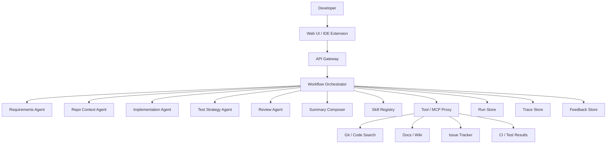
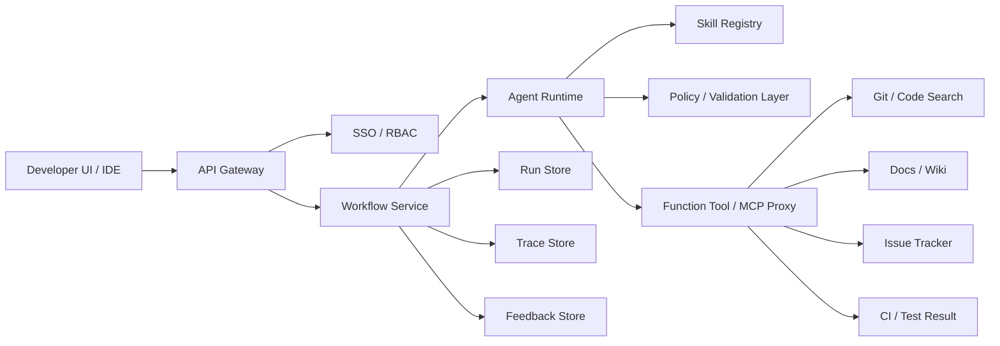

# PRD: 사내 개발자용 개발단계 멀티 에이전트 서비스

## 0. 문서 정보

- 문서 상태: draft v0.1
- 작성일: 2026-03-19
- 대상 독자: Product, DevEx, Platform, AI Infra, Security
- 문서 목적: MVP 범위, 역할 분리, API/백엔드 구조, 운영 기준을 정의한다

## 1. 제품 요약

본 서비스는 사내 개발자가 기능 개발, 버그 수정, 리팩터링, PR 준비 단계에서 자연어로 요청하면, 코드와 문서 맥락을 수집하고 변경 계획, 테스트 포인트, 리뷰 의견까지 순차적으로 생성하는 내부 개발 지원 서비스다.

기본 설계는 역할별 Skill과 중앙 오케스트레이터 기반의 멀티 에이전트 구조다. 공식 문서에서 제시하는 manager pattern과 handoff pattern 중, 이 서비스는 중앙에서 대화 제어, 출력 형식, 검증 지점, 권한 제어를 유지해야 하므로 manager pattern을 기본값으로 채택한다.

## 2. 배경 및 문제 정의

현재 개발 단계에서 반복적으로 발생하는 비효율은 아래와 같다.

- 요구사항을 개발 가능한 작업으로 해석하는 데 시간이 많이 든다
- 변경 영향 범위를 찾기 위해 여러 저장소, 문서, 이슈를 오가야 한다
- 구현 전 테스트 포인트와 리스크를 빠뜨리기 쉽다
- PR 초안이나 구현 계획이 사람마다 품질 편차가 크다
- 개발자, 리뷰어, QA가 같은 정보를 서로 다른 형식으로 재정리한다

이 서비스는 위 문제를 "요청 분해 -> 근거 수집 -> 구현 계획 -> 테스트 계획 -> 리뷰"의 표준 워크플로로 정리해 해결한다.

## 3. 목표

### 3.1 제품 목표

- 개발자가 변경 영향 범위를 파악하는 시간을 줄인다
- 구현 계획 초안 작성 시간을 줄인다
- 테스트 누락과 리뷰 누락을 줄인다
- 근거 기반의 일관된 개발 산출물을 만든다
- 사내 개발 표준과 아키텍처 규칙을 Skill로 재사용 가능하게 만든다

### 3.2 성공 상태

- 개발자는 하나의 입력만으로 영향 범위, 구현 순서, 테스트 체크리스트, 주요 리스크를 한 번에 받는다
- 결과물에는 항상 근거와 불확실성이 함께 표시된다
- 동일한 유형의 요청에 대해 팀 간 산출물 형식이 크게 흔들리지 않는다

## 4. 비목표

MVP 범위에서 아래 항목은 제외한다.

- 코드 자동 커밋
- 자동 머지
- 운영 환경 직접 변경
- 운영 데이터베이스 직접 실행
- 승인 없는 PR 생성 또는 댓글 작성
- 전 저장소를 대상으로 한 완전 자율 리팩터링

## 5. 제품 원칙

### 5.1 중앙 오케스트레이션 우선

MVP에서는 handoff가 아니라 manager pattern을 사용한다. 중앙 에이전트가 대화를 소유하고 specialist agent를 도구처럼 호출하는 방식을 기본으로 한다. 개발 단계 서비스는 최종 응답 형식과 정책을 중앙에서 강제해야 하므로 manager가 기본 선택이다.

### 5.2 Skill은 역할 단위로 분리

역할별 Skill을 따로 둔다. Skill은 반복 작업을 더 일관되게 수행하게 하는 재사용 워크플로이며, instructions, examples, code, supporting resources를 함께 묶을 수 있다. 따라서 Skill은 각 전문 에이전트의 작업 표준을 담당하고, 실행 흐름은 오케스트레이터가 담당한다.

### 5.3 모든 단계는 구조화된 출력으로 연결

각 서브에이전트는 자유 텍스트가 아니라 스키마 검증 가능한 JSON을 반환한다. 단계 간 계약은 structured output으로 고정한다.

### 5.4 근거 없는 단정 금지

- 파일명, 모듈명, 영향 범위를 추정으로만 단정하지 않는다
- 검색 근거가 약하면 confidence를 낮춰 반환한다
- 불확실한 항목은 open_questions에 남긴다

### 5.5 사람 승인 우선

- 계획 제안과 실제 변경 수행은 분리한다
- 외부 시스템에 쓰기 작업이 필요한 경우 반드시 승인 단계를 둔다

## 6. 대상 사용자

### 6.1 1차 사용자

- 백엔드 개발자
- 프론트엔드 개발자
- 플랫폼 엔지니어
- QA/SDET
- 기술 리드

### 6.2 핵심 사용 상황

- 새 기능 구현 전 영향 범위 분석
- 버그 수정 전 관련 코드/문서 탐색
- 리팩터링 전 변경 계획 수립
- PR 제출 전 사전 리뷰
- 테스트 시나리오 초안 작성

## 7. 범위

### 7.1 MVP 포함 범위

- 기능 요청을 개발 작업으로 정리
- 관련 코드/문서/이슈 탐색
- 구현 계획 초안 생성
- 테스트 체크리스트 생성
- PR 사전 리뷰 의견 생성
- 근거, 리스크, 오픈 이슈를 포함한 최종 응답 생성

### 7.2 차기 범위

- 코드 패치 초안 생성
- PR 설명문 자동 생성
- CI 실패 로그 원인 분석
- 보안 점검 전용 specialist agent
- 아키텍처 변경 영향 시뮬레이션

## 8. 에이전트 구성도

이 서비스는 중앙 오케스트레이터와 전문 서브에이전트로 구성한다.



### 8.1 에이전트 역할 정의

#### 8.1.1 Workflow Orchestrator

- 역할: 사용자 요청을 분류하고 전체 실행 순서를 결정한다
- 책임:
  - 요청 유형 분류
  - 필요한 specialist agent 선택
  - 결과 병합
  - 최종 응답 형식 보장
- 실패 조건:
  - 근거 없는 요약
  - specialist output 누락
  - 필수 섹션 누락

#### 8.1.2 Requirements Agent

- 역할: 자연어 요구를 개발 가능한 작업으로 재구성한다
- 책임:
  - feature summary 작성
  - acceptance criteria 정리
  - non-goals 정리
  - 영향 범위 가설 수립
- MVP 포함 여부: 선택적 포함
- 권장 적용 시점: 이슈/요구사항 텍스트 입력이 많은 팀

#### 8.1.3 Repo Context Agent

- 역할: 관련 코드, 설계 문서, 유사 구현, 의존성 맥락을 수집한다
- 책임:
  - 관련 파일 후보 제시
  - 기존 패턴 검색
  - 유사 구현 예시 추출
  - 의존성 및 경계 파악
- MVP 포함 여부: 필수

#### 8.1.4 Implementation Agent

- 역할: 근거를 기반으로 구현 계획을 만든다
- 책임:
  - 수정 대상 모듈 제안
  - 변경 순서 정리
  - API/데이터 모델 변화 표시
  - 롤백 고려사항 정리
- MVP 포함 여부: 필수

#### 8.1.5 Test Strategy Agent

- 역할: 테스트 범위와 시나리오를 만든다
- 책임:
  - 단위 테스트 포인트
  - 통합 테스트 포인트
  - 회귀 범위
  - 에지 케이스
- MVP 포함 여부: 2차 포함 권장

#### 8.1.6 Review Agent

- 역할: 전체 결과의 위험 요소와 누락을 검토한다
- 책임:
  - 근거 부족 검출
  - 숨은 의존성 탐지
  - 회귀 위험 정리
  - 보안/성능/호환성 점검
- MVP 포함 여부: 필수

#### 8.1.7 Summary Composer

- 역할: 사용자에게 최종 결과를 전달하는 응답 객체를 구성한다
- 책임:
  - 결과 요약
  - impacted areas 정리
  - implementation plan 정리
  - tests, risks, open questions 정리
- MVP 포함 여부: 필수

## 9. Skill 목록 및 역할 정의

Skill은 반복 작업을 일관되게 수행하게 만드는 재사용 워크플로이므로, 본 서비스는 에이전트별로 Skill을 1개씩 분리한다. 필요 시 여러 Skill이 함께 적용될 수 있으나, 운영 관점에서는 역할별 분리가 디버깅과 개선에 유리하다.

### 9.1 workflow-orchestrator

- 연결 에이전트: Workflow Orchestrator
- 목적: 요청 유형을 분류하고 실행 순서를 결정한다
- 주요 입력:
  - 사용자 요청
  - repo scope
  - branch
  - linked artifact 정보
- 주요 출력:
  - selected_agents
  - execution_plan
  - final_response_envelope
- 포함 리소스 예시:
  - `references/workflow-rules.md`
  - `references/output-contract.md`

### 9.2 repo-context-finder

- 연결 에이전트: Repo Context Agent
- 목적: 코드/문서/이슈 근거를 수집한다
- 주요 입력:
  - repo_id
  - branch
  - request_summary
  - keywords
- 주요 출력:
  - related_files
  - relevant_docs
  - similar_implementations
  - uncertainty_list
- 포함 리소스 예시:
  - `references/repo-map.md`
  - `references/architecture-notes.md`
  - `scripts/module_impact_scanner.py`

### 9.3 implementation-planner

- 연결 에이전트: Implementation Agent
- 목적: 변경 계획과 구현 순서를 만든다
- 주요 입력:
  - repo_context_result
  - acceptance_criteria
- 주요 출력:
  - change_plan
  - target_modules
  - api_changes
  - migration_needs
  - rollback_notes
- 포함 리소스 예시:
  - `references/coding-patterns.md`
  - `references/service-boundaries.md`

### 9.4 review-gate

- 연결 에이전트: Review Agent
- 목적: 결과물의 누락과 위험을 검토한다
- 주요 입력:
  - implementation_result
  - test_result
  - evidence
- 주요 출력:
  - missing_evidence
  - hidden_dependencies
  - regression_risks
  - security_performance_flags
  - readiness_verdict
- 포함 리소스 예시:
  - `references/review-checklist.md`
  - `references/security-baseline.md`
  - `scripts/risk_ranker.py`

### 9.5 requirements-planner

- 연결 에이전트: Requirements Agent
- 목적: 자연어 요구를 개발 작업 단위로 바꾼다
- 주요 입력:
  - issue text
  - spec text
  - conversation summary
- 주요 출력:
  - feature_summary
  - acceptance_criteria
  - assumptions
  - non_goals
- 포함 리소스 예시:
  - `references/requirement-template.md`

### 9.6 test-strategy-generator

- 연결 에이전트: Test Strategy Agent
- 목적: 테스트 범위를 설계한다
- 주요 입력:
  - implementation_plan
  - impacted_areas
- 주요 출력:
  - unit_tests
  - integration_tests
  - regression_targets
  - edge_cases
- 포함 리소스 예시:
  - `references/test-policy.md`
  - `references/qa-checklist.md`

## 10. API 및 백엔드 구조

structured output, 일반 tools, MCP-backed tools를 함께 쓸 수 있으므로 백엔드는 중앙 오케스트레이터, 외부 시스템 접근용 tool/MCP 계층, 결과 저장 및 관측 계층으로 나누는 것이 적합하다.

### 10.1 논리 구조



### 10.2 핵심 컴포넌트

#### 10.2.1 API Gateway

- 인증: SSO 기반
- 권한: repo, docs, issue tracker 접근 권한 상속
- 기능:
  - request validation
  - rate limiting
  - request ID 발급
  - session 관리

#### 10.2.2 Workflow Service

- 역할:
  - 요청 정규화
  - workflow type 결정
  - sync/async 실행 결정
  - 결과 캐시와 상태 관리
- 책임:
  - 요청별 run_id 발급
  - run state 저장
  - orchestrator 호출

#### 10.2.3 Agent Runtime

- 역할:
  - 오케스트레이터 및 specialist agent 실행
  - structured output 검증
  - skill loading
  - tool invocation
- 설계 원칙:
  - 에이전트 간 직접 통신 금지
  - 모든 단계는 오케스트레이터를 경유
  - 모든 외부 읽기/쓰기 작업은 tool 계층을 경유

#### 10.2.4 Tool / MCP Proxy

- 역할:
  - Git/code search
  - 문서 검색
  - 이슈/PR 조회
  - CI 결과 조회
- 정책:
  - 외부 시스템 접근은 최소 권한 원칙 적용
  - 응답은 표준 evidence 객체로 정규화
- evidence 표준 필드:
  - source_type
  - source_id
  - locator
  - snippet
  - timestamp
  - confidence

#### 10.2.5 Skill Registry

- 역할:
  - Skill 버전 관리
  - role별 활성 Skill 매핑
  - canary rollout 지원
- 정책:
  - Skill 수정 시 버전 증가
  - run 결과에 skill_version 기록

#### 10.2.6 Run/Trace/Feedback Stores

- Run Store:
  - 요청/응답/상태 저장
- Trace Store:
  - 에이전트 호출 이력
  - tool 호출 이력
  - 검증 이력
- Feedback Store:
  - 사용자 만족도
  - 수정 요청
  - human override 내역

### 10.3 권장 API 엔드포인트

#### 10.3.1 분석 실행

`POST /v1/workflows/plan`

요청 예시:

```json
{
  "request_type": "feature",
  "repo_id": "user-service",
  "branch": "feature/timezone-profile",
  "task_text": "사용자 프로필 수정 API에 timezone 필드를 추가할 때 영향 범위와 구현 계획을 정리해줘.",
  "artifacts": {
    "issue_ids": ["DEV-123"],
    "pr_url": null
  },
  "options": {
    "include_tests": true,
    "language": "ko"
  }
}
```

응답 예시:

```json
{
  "run_id": "run_01",
  "status": "completed",
  "summary": "프로필 저장 경로, 검증 로직, 응답 스키마에 영향이 있습니다.",
  "impacted_areas": [
    "profile controller",
    "profile service",
    "request/response schema",
    "client settings page"
  ],
  "implementation_plan": [
    "DTO에 timezone 필드 추가",
    "유효한 timezone 검증 추가",
    "저장 로직 반영",
    "응답 스키마 및 문서 수정"
  ],
  "tests": [
    "유효 timezone 저장 성공",
    "잘못된 timezone 저장 실패",
    "기존 API 호환성 유지"
  ],
  "risks": [
    "기존 클라이언트와의 역호환성",
    "기본 timezone 처리 정책 누락"
  ],
  "open_questions": [
    "기본값 정책을 서버가 강제할지 여부"
  ],
  "evidence": [
    {
      "source_type": "repo",
      "locator": "src/profile/service.ts",
      "confidence": "high"
    }
  ]
}
```

#### 10.3.2 PR 사전 리뷰

`POST /v1/workflows/review`

#### 10.3.3 테스트 계획 생성

`POST /v1/workflows/test-plan`

#### 10.3.4 실행 상태 조회

`GET /v1/workflows/{run_id}`

#### 10.3.5 트레이스 조회

`GET /v1/workflows/{run_id}/trace`

#### 10.3.6 사용자 피드백 저장

`POST /v1/feedback`

## 11. MVP 시나리오

### 11.1 시나리오 A: 새 기능 영향 범위 분석

입력:

- "사용자 프로필 수정 API에 timezone 필드를 추가하려고 한다. 영향 범위와 구현 계획을 정리해줘."

기대 흐름:

1. Orchestrator가 feature request로 분류
2. Repo Context Agent가 관련 API, DTO, validation, client usage 탐색
3. Implementation Agent가 변경 순서와 호환성 포인트 정리
4. Review Agent가 누락 위험과 기본값 정책 이슈 지적
5. Summary Composer가 최종 결과 조립

성공 기준:

- 영향 범위 3개 이상 제시
- 구현 단계가 순서대로 정리됨
- 최소 2개 이상의 테스트 포인트 포함
- compatibility risk 포함

### 11.2 시나리오 B: 버그 수정 계획

입력:

- "특정 조건에서 주문 생성이 중복된다. 어디를 먼저 봐야 하는지와 수정 계획을 정리해줘."

기대 흐름:

1. bugfix로 분류
2. Repo Context Agent가 중복 생성 지점, lock/retry/idempotency 관련 코드 탐색
3. Implementation Agent가 수정 후보와 검증 전략 정리
4. Review Agent가 race condition, rollback, side effect 검토

성공 기준:

- 재현 포인트와 수정 포인트가 분리되어 제시됨
- race condition 또는 동시성 리스크가 별도 표기됨

### 11.3 시나리오 C: PR 사전 리뷰

입력:

- "이 PR 초안의 리스크와 누락 테스트를 확인해줘."

기대 흐름:

1. review 요청으로 분류
2. Repo Context Agent가 diff, 관련 모듈, 기존 테스트 탐색
3. Test Strategy Agent가 누락 테스트 추출
4. Review Agent가 회귀 리스크, 숨은 의존성, 문서 누락 검토
5. Summary Composer가 리뷰 코멘트 초안 생성

성공 기준:

- 리스크 2개 이상 또는 누락 없음 명시
- 테스트 누락 여부를 구체적으로 표기
- 근거가 없는 지적은 금지

### 11.4 시나리오 D: 리팩터링 전 검토

입력:

- "이 서비스 레이어를 분리하려고 한다. 변경 전 확인할 의존성과 위험을 정리해줘."

기대 흐름:

1. refactor로 분류
2. Repo Context Agent가 의존성 경계와 호출 경로 탐색
3. Implementation Agent가 단계적 변경 계획 작성
4. Review Agent가 숨은 결합, 순환 의존성, 배포 위험 검토

성공 기준:

- 의존성 목록
- 단계별 실행 순서
- rollback 또는 fallback 고려사항 포함

## 12. 기능 요구사항

### 12.1 요청 분류

- 시스템은 입력 요청을 feature, bugfix, refactor, review 중 하나 이상으로 분류해야 한다
- 다중 의도가 섞인 경우 primary intent와 secondary intent를 분리해야 한다

### 12.2 컨텍스트 수집

- 시스템은 repo, docs, issue, CI 등 연결 가능한 소스에서 근거를 수집해야 한다
- 모든 근거는 evidence 객체로 정규화해야 한다
- 근거가 약한 항목은 confidence를 낮춰야 한다

### 12.3 구현 계획 생성

- 시스템은 변경 대상, 단계, 리스크, 롤백 포인트를 포함한 계획을 만들어야 한다
- 계획은 실제 코드 작성과 분리되어야 한다

### 12.4 테스트 계획 생성

- 시스템은 단위 테스트, 통합 테스트, 회귀 테스트를 분리해 제안해야 한다
- 테스트가 불필요한 경우 그 이유를 명시해야 한다

### 12.5 리뷰 생성

- 시스템은 누락 근거, 숨은 의존성, 보안/성능/호환성 위험을 검토해야 한다
- 근거 없는 추측성 리뷰는 금지한다

### 12.6 최종 응답 형식

최종 응답은 아래 필드를 포함해야 한다.

- summary
- impacted_areas
- implementation_plan
- tests
- risks
- open_questions
- evidence
- confidence

## 13. 비기능 요구사항

### 13.1 성능

- 일반 질의: 첫 응답 5초 이내 시작
- 중간 규모 분석: 30초 이내 완료 목표
- 장기 작업: async job 전환 허용

### 13.2 신뢰성

- workflow 단계별 실패 원인 추적 가능
- 부분 실패 시 graceful degradation
- 외부 검색 실패 시 fallback 메시지 제공

### 13.3 보안

- 사용자 권한 범위 밖의 repo/doc 접근 금지
- 민감정보가 포함된 결과는 마스킹
- write action은 기본 비활성화

### 13.4 감사 가능성

- run_id 단위 감사 가능
- skill_version, tool call, user feedback 기록
- 동일 요청 재현 가능성 확보

## 14. 운영, 트레이싱, 가드레일

운영 환경에서는 모든 workflow를 trace 단위로 저장하고, run_id와 trace_id를 연결해야 한다. 가드레일은 중앙 오케스트레이터와 핵심 외부 I/O function tool 쪽에서 통제하는 구조를 기본으로 한다.

### 14.1 필수 운영 규칙

- 외부 시스템 접근은 function tool 또는 MCP proxy를 통해서만 수행
- run마다 trace_id, user_id, repo_scope 저장
- skill_version과 model_version을 결과에 기록
- reviewer 단계는 항상 마지막에 수행
- confidence가 low인 경우 사용자에게 불확실성 명시

### 14.2 승인 포인트

- PR 생성
- PR 댓글 작성
- 이슈 업데이트
- 코드 패치 반영
- 문서 수정 반영

위 항목은 모두 human approval 이후에만 실행한다.

## 15. MVP 출시 계획

### 15.1 Phase 1

- Workflow Orchestrator
- Repo Context Agent
- Implementation Agent
- Review Agent
- plan/review API
- run/trace 저장

### 15.2 Phase 2

- Test Strategy Agent 추가
- issue/doc ingestion 강화
- feedback loop 적용
- IDE extension 연결

### 15.3 Phase 3

- Requirements Agent 추가
- code patch draft 기능 추가
- PR description 자동 생성
- canary skill rollout

## 16. 성공 지표

### 16.1 제품 지표

- 주간 활성 사용자 수
- 사용자 1인당 주간 실행 수
- 요청당 평균 수정 시간 절감 체감 점수
- 결과 재사용률

### 16.2 품질 지표

- evidence 포함 응답 비율
- human accept 비율
- low confidence 응답 비율
- reviewer가 추가로 발견한 리스크 비율
- 잘못된 파일/모듈 제안 비율

### 16.3 운영 지표

- 평균 응답 시간
- tool 실패율
- 외부 시스템 timeout 비율
- trace 누락 비율
- skill version별 오류율

## 17. 리스크 및 대응

### 17.1 잘못된 영향 범위 제안

대응:

- evidence 기반 출력 강제
- confidence 표시
- review 단계에서 누락 여부 재검토

### 17.2 외부 검색 품질 부족

대응:

- connector별 fallback 정책
- repo/doc/issue/CI를 분리 호출
- 검색 실패와 근거 부족을 구분해 표기

### 17.3 Skill 드리프트

대응:

- skill_version 고정
- canary rollout
- feedback 기반 회귀 테스트

### 17.4 과도한 자율성

대응:

- write action 비활성화 기본값
- human approval mandatory
- 자동 실행 범위를 plan/review 중심으로 제한

## 18. 오픈 이슈

- 사내 Git 저장소와 코드 검색은 어떤 시스템을 기준으로 할 것인가
- 문서 소스는 위키, 노션, 드라이브 중 무엇이 1차 대상인가
- 이슈 시스템은 Jira인지 GitHub Issues인지
- CI 결과와 테스트 로그는 어떤 API로 연결할 것인가
- repo 권한 상속은 어떤 identity provider를 기준으로 할 것인가
- 한국어 응답을 기본값으로 할지, 코드 리뷰는 영어 병기할지
- MVP에서 PR diff 단위 분석까지 포함할지

## 19. 최종 결정안

MVP는 아래 4개로 시작한다.

- Workflow Orchestrator
- Repo Context Agent
- Implementation Agent
- Review Agent

이 조합으로 먼저 아래 3개를 해결한다.

- 영향 범위 분석
- 구현 계획 초안 생성
- PR 사전 리뷰

이후 Test Strategy Agent와 Requirements Agent를 붙여 확장한다.
