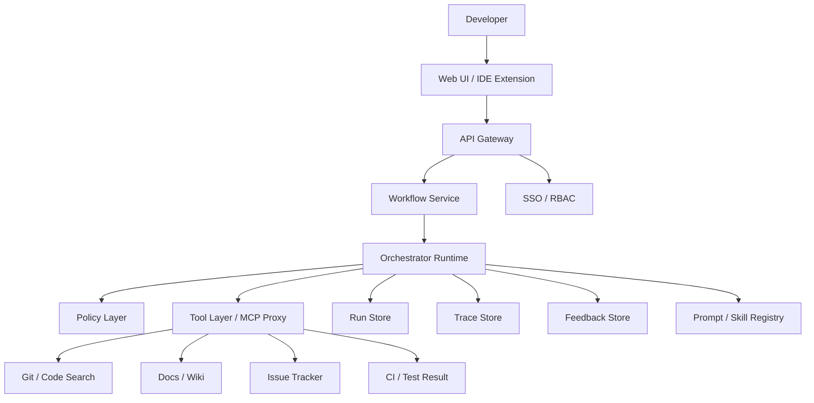
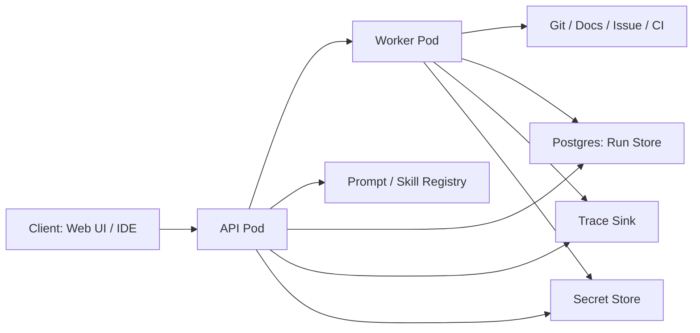
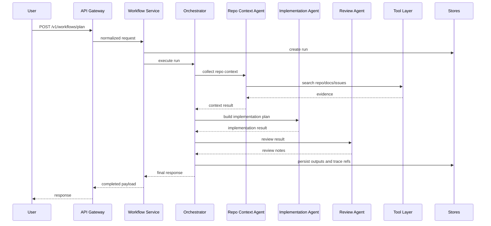
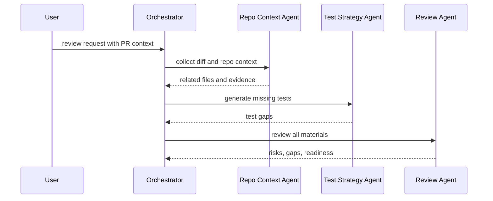

# 시스템 아키텍처 상세 설계서

## 1. 목적

이 문서는 PRD를 구현 가능한 시스템 구조로 세분화하기 위한 상세 설계서다. 범위는 다음과 같다.

- 런타임 구성요소
- 배포 구조
- 에이전트 실행 순서
- 데이터 계약
- 저장 계층
- 권한/보안
- 운영/관측/가드레일

## 2. 설계 원칙

- 중앙 오케스트레이터가 전체 run을 소유한다
- specialist agent는 독립된 역할만 담당한다
- 모든 단계는 구조화된 JSON으로 연결한다
- 외부 시스템 접근은 tool layer 또는 MCP proxy만 사용한다
- write action은 명시적 승인 이후에만 허용한다
- run, trace, feedback은 분리 저장한다
- prompt와 skill은 분리 관리하되 versioning 규칙은 동일하게 적용한다

## 3. 상위 아키텍처

## 4. 런타임 구성요소

### 4.1 API Gateway

역할:
- 인증과 권한 검증
- request normalization
- rate limit
- run_id 발급
- session correlation

입력:
- REST 요청
- 인증 토큰
- 사용자 메타데이터

출력:
- 정규화된 workflow request

### 4.2 Workflow Service

역할:
- 요청 타입 분류
- sync/async 실행 정책 결정
- run state 관리
- 오케스트레이터 호출
- 결과 저장과 조회

내부 책임:
- 요청 유효성 검증
- 기본 repo scope 적용
- timeout 제어
- 실패 정책 관리

### 4.3 Orchestrator Runtime

역할:
- specialist agent 순서 결정
- tool 사용 시점 통제
- 결과 병합
- 최종 응답 스키마 보장

선택 규칙:
- feature / bugfix / refactor / review / test_plan
- 요청에 artifact가 있으면 repo-context를 우선 호출
- review 요청은 review-gate를 필수 호출
- include_tests 옵션이 true면 test-strategy-generator 호출

### 4.4 Specialist Agents

#### Repo Context Agent
- 코드, 문서, 이슈, CI 근거 수집
- 관련 파일, 패턴, 의존성 요약

#### Implementation Agent
- 변경 모듈, 순서, API/데이터 모델 변경, 롤백 포인트 정리

#### Test Strategy Agent
- 단위, 통합, 회귀, 에지 테스트 시나리오 생성

#### Review Agent
- 누락 근거, 숨은 의존성, 성능/보안/호환성 리스크 검토

#### Requirements Agent
- 자연어 요구를 acceptance criteria 중심으로 정규화

### 4.5 Policy Layer

역할:
- 입력 검증
- structured output 검증
- 민감정보 마스킹
- 승인 필요 action 차단
- confidence 기준 적용

정책 예시:
- 근거 없는 파일명 단정 금지
- confidence low이면 최종 응답에 명시
- write action은 approval token 없으면 차단

### 4.6 Tool Layer / MCP Proxy

역할:
- 외부 시스템 읽기/쓰기 추상화
- tool별 표준 evidence 객체 반환
- MCP server 접근 관리
- repo/doc/issue/ci 응답 포맷 통일

권장 분리:
- repo_search_tool
- docs_search_tool
- issue_lookup_tool
- ci_lookup_tool
- approval_gate_tool

## 5. 배포 구조

### 5.1 최소 배포 단위

- api service
- worker service
- postgres
- trace exporter
- secret manager integration

### 5.2 배포 환경

- local: 단일 프로세스, in-memory store 가능
- dev: api + worker + postgres
- prod: autoscaling api/worker, managed postgres, centralized tracing

## 6. 데이터 모델

### 6.1 핵심 엔터티

#### WorkflowRun
- run_id
- request_type
- user_id
- repo_id
- branch
- status
- created_at
- completed_at
- model_version
- skill_versions
- trace_id

#### AgentStepResult
- step_name
- step_order
- status
- started_at
- ended_at
- input_ref
- output_ref
- confidence
- token_usage
- error_code
- error_message

#### Evidence
- source_type
- source_id
- locator
- snippet
- timestamp
- confidence

#### Feedback
- feedback_id
- run_id
- rating
- useful
- comment
- created_at

## 7. 시퀀스 다이어그램

### 7.1 plan 요청

### 7.2 review 요청

## 8. 저장 계층

### 8.1 Run Store

권장: Postgres

저장 내용:
- run metadata
- request payload
- final response
- agent step summary
- approval state

### 8.2 Trace Store

선택지:
- OpenAI tracing sink
- OTLP exporter
- vendor APM

저장 내용:
- trace_id
- span tree
- agent / tool execution timing
- model usage
- errors

### 8.3 Feedback Store

저장 내용:
- thumbs up/down
- free-form comment
- correction request
- accepted / edited / rejected state

## 9. 보안 설계

### 9.1 인증

- SSO 기반 인증
- 사내 identity provider 연동
- API token은 서비스 간 통신용만 사용

### 9.2 권한

- repo/doc/issue 접근 권한은 사용자 권한 상속
- privilege escalation 금지
- tool layer가 scope enforcement 책임을 가진다

### 9.3 민감정보 처리

- tool 응답에서 secret pattern masking
- environment variable, token, key, password 탐지 규칙 적용
- final response에는 민감정보 제거

### 9.4 승인 워크플로

필수 승인 대상:
- PR 생성
- PR comment 작성
- issue 변경
- wiki 수정
- code patch 반영

## 10. 가드레일 설계

가드레일 계층은 다음 세 곳에 둔다.

- 입력 가드레일
- tool 가드레일
- 최종 출력 가드레일

정책 예시:
- repo 범위 밖 접근 요청 차단
- 공격성 프롬프트와 무관한 작업 차단
- tool 결과가 빈 경우 fallback message 강제
- final output에 evidence가 없으면 warning 부착

## 11. 실패 처리

### 11.1 실패 유형

- connector timeout
- no evidence found
- schema validation failure
- model failure
- approval missing
- rate limit exceeded

### 11.2 대응 정책

- connector timeout: partial result + degraded mode
- no evidence found: low confidence + open questions
- schema validation failure: step retry 1회
- model failure: backup model or failure message
- approval missing: write action 중단
- rate limit: retry-after 반환

## 12. 운영/관측

### 12.1 필수 메트릭

- request count
- run completion rate
- step error rate
- median / p95 latency
- tool success rate
- low confidence rate
- human override rate

### 12.2 로그 기준

- run_id, trace_id, user_id, repo_id, request_type
- selected agents
- tool calls
- token usage
- latency

### 12.3 알림 기준

- step error rate 급증
- connector timeout 급증
- trace export 실패
- approval bypass 시도 탐지
- low confidence 비율 급증

## 13. 기술 결정

- 언어: Python
- API: FastAPI
- runtime: openai-agents
- schema: Pydantic + OpenAPI
- store: Postgres
- async worker: 추후 Celery 또는 event queue 확장 가능
- tracing: OpenAI tracing + OTLP export 확장 고려

## 14. 구현 순서

1. contracts + API skeleton
2. orchestrator + repo-context + implementation + review
3. run store + trace store 연결
4. test-strategy 추가
5. approval workflow 추가
6. IDE extension 또는 internal UI 연결
